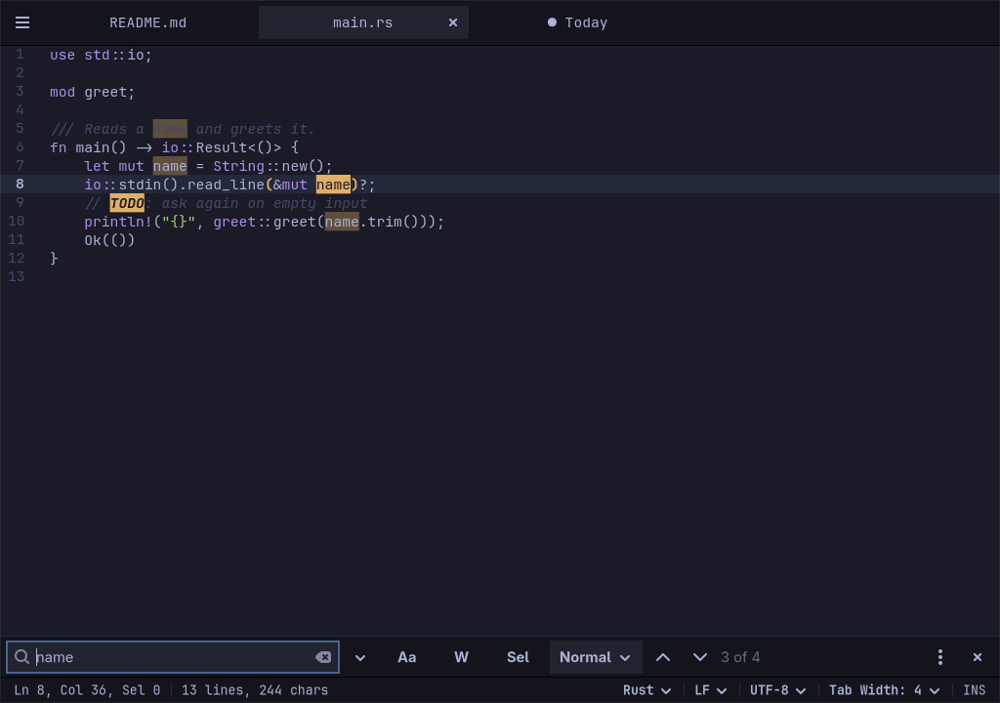

# Stet

A fast text and code editor for Omarchy, written in Rust.

**Keyboard-first, and it never loses your work.** The name is the proofreading mark *stet*, Latin for "let it stand", which cancels a correction.

Stet is a native GTK4 + libadwaita + GtkSourceView 5 editor with the features people reach for every day:

- tabs whose unsaved and untitled contents survive quitting and rebooting, with no save prompts;
- regex find and replace, Find All, and Find and Replace in Files with a results panel;
- line tools, case conversion, comment toggling, and JSON/XML formatting;
- column editing, bookmarks and Mark;
- quick open, a Ctrl+Tab switcher, back and forward;
- split view, and two files compared side by side;
- careful handling of encodings and line endings, in files up to 256 MiB;
- familiar keyboard shortcuts, your own in `keys.toml`, and an F1 command palette;
- the live Omarchy theme and font, updated when you switch themes.



## Install

On Omarchy or Arch Linux:

1. Open a terminal. In Omarchy, press **Super + Enter**.
2. Copy these three lines, paste them into the terminal with **Ctrl + Shift + V**, and press **Enter**:

   ```bash
   curl -fLO https://github.com/PixDevsApps/Stet/releases/download/v1.3.4/stet-1.3.4-1-x86_64.pkg.tar.zst
   sudo pacman -U stet-1.3.4-1-x86_64.pkg.tar.zst
   rm stet-1.3.4-1-x86_64.pkg.tar.zst
   ```

   The first line downloads Stet, the second installs it, and the third deletes the download. When the terminal asks for your password, type it and press **Enter**; nothing shows while you type, which is normal. When it asks *Proceed with installation? [Y/n]*, press **Enter**.
3. Start Stet from the app launcher (in Omarchy, press **Super + Space** and type *Stet*), or type `stet` in a terminal and press **Enter**.

To have your text files open in Stet, choose **Settings › Set as Default Editor…** in Stet's menu (**☰**, at the left of the tabs). To update when a new version is out, run the lines above again: they always name the [latest release](https://github.com/PixDevsApps/Stet/releases/latest). To remove Stet, run `sudo pacman -R stet`; your unsaved drafts stay in `~/.local/state/stet`.

## Status

**Stet 1.3.4** (2026-10-02) is the latest release; the [release notes](docs/RELEASE_NOTES.md) list what each version added. There is no AUR package yet.

## Build from source

On Arch/Omarchy:

```sh
git clone https://github.com/PixDevsApps/Stet.git stet
cd stet
sudo pacman -S --needed rust gtk4 libadwaita gtksourceview5 pcre2 pkgconf
cargo build
cargo run -- <files>
```

Debug builds use the app-id `io.github.pixdevsapps.Stet.Devel`, so they never forward to an installed copy.

A local Arch package, built from the committed tree:

```sh
python3 tools/package-source.py
cd .local/package && makepkg --cleanbuild --force
sudo pacman -U stet-<version>-1-x86_64.pkg.tar.zst
```

Details are in [BUILD.md](docs/BUILD.md); installing for your user only, and making Stet the default editor, in [INSTALL.md](docs/INSTALL.md).

## Documentation

| Document | Contents |
| --- | --- |
| [Install](docs/INSTALL.md) | Building, the Arch package, a user-local install, making Stet the default editor |
| [User guide](docs/USER_GUIDE.md) | Using Stet: files, search, text tools, indentation, `config.toml`, `keys.toml`, the keymap |
| [Product requirements](docs/PRD.md) | Problem, users, positioning, feature tiers, goals and non-goals |
| [Plan](docs/PLAN.md) | Current state, milestones M0–M9, scope control, authorization log |
| [Decisions](docs/DECISIONS.md) | Architecture decision records |
| [Design](docs/DESIGN.md) | Window layout, theme tokens, chrome rules |
| [Research](docs/RESEARCH.md) | Condensed research and M0 spike results |
| [Build](docs/BUILD.md) | Toolchain, workspace layout, commands, packaging, spikes |
| [Testing](docs/TESTING.md) | Test strategy, the `--self-test` scripts, performance targets, manual Omarchy acceptance |
| [Integrations](docs/INTEGRATIONS.md) | Omarchy theme, font, desktop entry, default editor, snippets |
| [Assets](docs/ASSETS.md) | Icon and fixture provenance |
| [Operating guide](docs/OPERATING.md) | How work proceeds: milestones, preview gates, authorizations |
| [Upstream issue draft](docs/upstream/sourceview5-replace-all.md) | The `sourceview5` search-binding bugs, for the user to file |
| [Third-party notices](THIRD_PARTY.md) | System libraries and Rust crate licenses |
| [Contributing](CONTRIBUTING.md) | Workflow, checks, ADRs, docs rule |
| [Agent guide](AGENTS.md) | Rules for coding agents working in this repository |

## License

MIT; see [LICENSE](LICENSE). GTK, libadwaita, GtkSourceView, PCRE2 and the Rust dependencies keep their own licenses.
